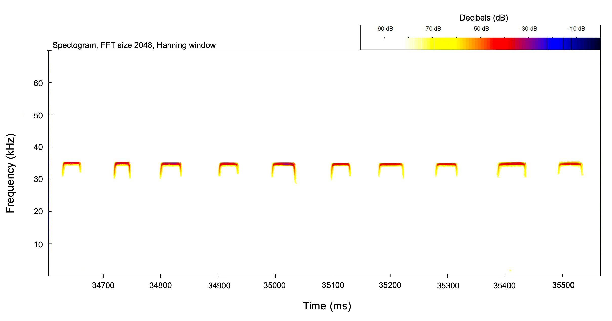

{=html}

{=html}

## Leucostethus jota

::: tab
<button class="tablinks" onclick="openTab(event, &#39;DescripcionL&#39;)">

Descripción

</button>

<button class="tablinks" onclick="openTab(event, &#39;EspectrogramaL&#39;)">

Espectrograma

</button>

<button class="tablinks" onclick="openTab(event, 'TablasL')">Tablas</button> <button class="tablinks" onclick="openTab(event, 'AudiosL')">Audios</button>
:::

::: {#DescripcionL .tabcontent}
<h3>Descripción</h3>

Si utiliza los datos, cítese como:

<strong>Marín, C.M., C. Molina-Zuluaga, A. Restrepo, E.Cano & J.M. Daza.</strong> 2018. A new species of <i>Leucostethus</i> (Anura: Dendrobatidae) from the eastern versant of the Central Cordillera of Colombia with comments on the phylogenetic position of <i>Colostethus fraterdanieli</i>. <i>Zootaxa</i> 4461: 359--380. <a href="https://doi.org/10.11646/zootaxa.4461.3.3">https://doi.org/10.11646/zootaxa.4461.3.3</a>.

:::

::: {#EspectrogramaL .tabcontent}
<h3>Espectrograma</h3>

:::

::: {#TablasL .tabcontent}
<h3>Tablas</h3>

Tabla de medidas

Tabla de seleccion (Raven)

:::

::: {#AudiosL .tabcontent}
<h3>Audios</h3>

::: audio-container
    <audio controls>
      <source src="Audios/JAGUAS259_20130118_125515.wav" type="audio/wav">
      Tu navegador no soporta el elemento de audio.
    </audio>
    <audio controls>
      <source src="Audios/JAGUAS259_20130118_125515.wav" type="audio/wav">
      Tu navegador no soporta el elemento de audio.
    </audio>
:::
:::
