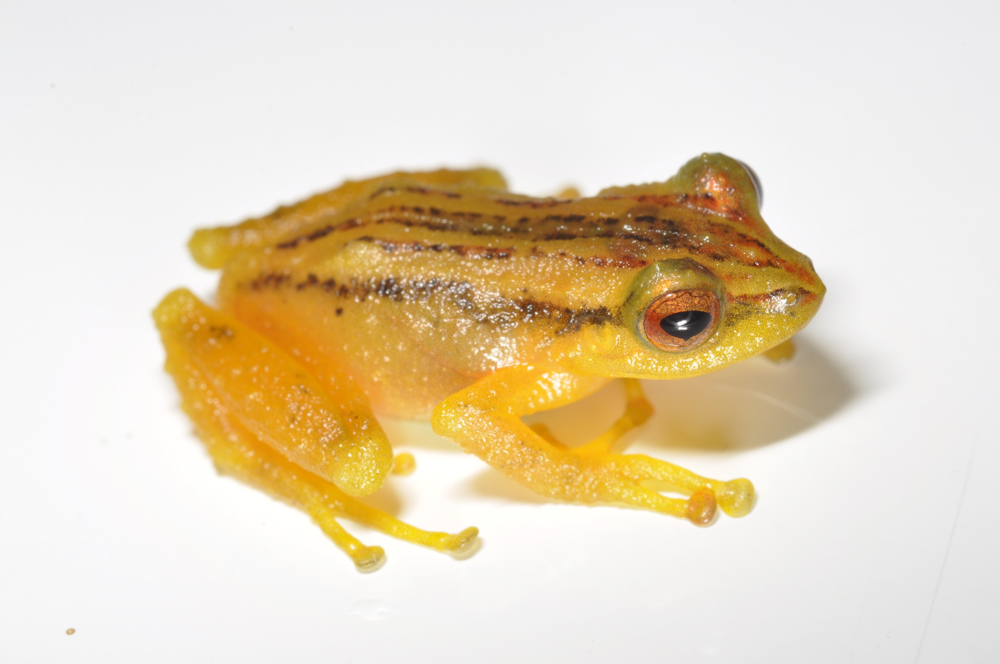

## Pristimantis dorsopictus

  <button class="tablinks" onclick="openTab(event, 'DescripcionD')">Descripción</button>
  <button class="tablinks" onclick="openTab(event, 'EspectrogramaD')">Espectrograma</button>
  <button class="tablinks" onclick="openTab(event, 'TablasD')">Tablas</button>
  <button class="tablinks" onclick="openTab(event, 'AudiosD')">Audios</button>

  <h3>Descripción</h3>
  

  
Si utiliza los datos, cítese como:

  
<strong>Patiño-Ocampo E., S. Duarte-Marín y M. Rivera-Correa.</strong> 2022. Genética, bioacústica y morfología revelan una nueva especie oculta en <i>Pristimantis dorsopictus </i> (Anura: Strabomantidae). Revista Latinoamericana de Herpetología 5 (1): 60-9. <a href="https://doi.org/10.11646/zootaxa.4461.3.3">https://doi.org/10.11646/zootaxa.4461.3.3</a>

  <h3>Espectrograma</h3>
   <video width="100%" height="auto" controls>
  <source src="Espectrograms/Espectrograma.mp4" type="video/mp4">
    Tu navegador no soporta el elemento de video.
  </video>

  <h3>Tablas</h3>
  
Tabla de medidas

  
Tabla de seleccion (Raven)

  <h3>Audios</h3>
  

    <audio controls>
      <source src="Audios/MHUA-A12492_Pristimantis_dorsopictus.wav" type="audio/wav">
      Tu navegador no soporta el elemento de audio.
    </audio>
  

  
Más audios disponibles <a href="https://www.dropbox.com/scl/fo/3e0geqsqrevgn5h0uhyva/ABWC4lbYqpfFH-6L4Og6mQI?rlkey=tuiauwycw0lw58n9co6fncgaw&e=1&dl=0">aquí</a>.

